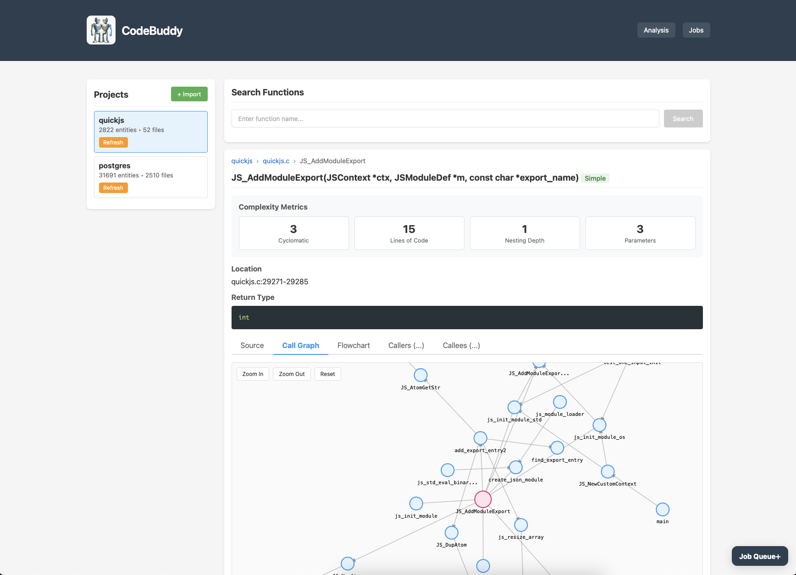
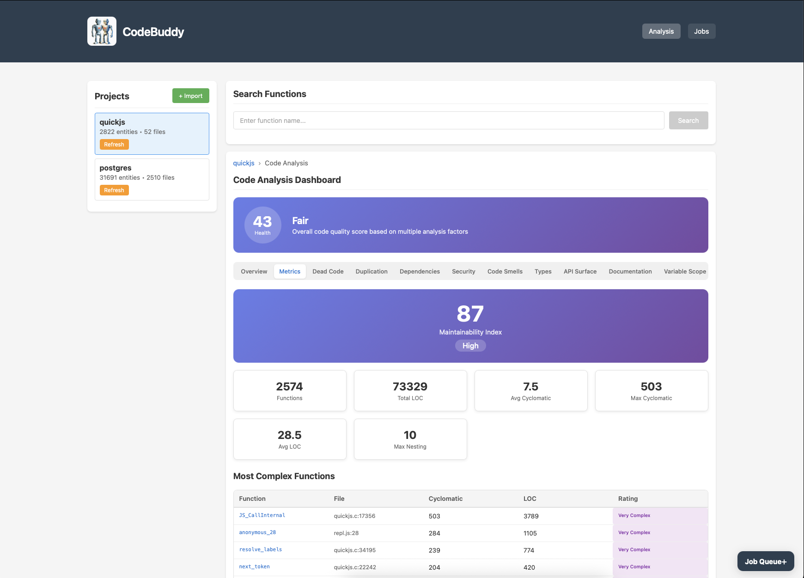

# CodeBuddy

CodeBuddy is a code analysis and knowledge graph tool that parses source code using tree-sitter, extracts functions, classes, and their relationships, and provides comprehensive code analysis capabilities. It supports multiple programming languages and offers three interfaces: an MCP (Model Context Protocol) server for AI assistant integration, a REST API with web interface, and a command-line tool.

## Features

### Code Parsing and Analysis
- Multi-language support: C, C++, C#, Go, Java, JavaScript, TypeScript, Python, Ruby, Rust, Swift, PHP, and Zig
- Function and method extraction with parameters, return types, and documentation
- Class and struct detection with member function relationships
- Call graph analysis showing caller/callee relationships
- Caller and callee tree generation
- Control flow graph generation

### Code Quality Analysis
- Dead code detection (unreferenced functions)
- Code duplication detection
- Cyclomatic complexity metrics
- Code smell detection (long methods, deep nesting, etc.)
- Security vulnerability scanning
- Documentation coverage analysis
- Type coverage analysis for dynamic languages
- API surface analysis
- Variable scope analysis
- Dependency analysis with circular dependency detection

### Interfaces
- **MCP Server**: Integration with AI assistants via Model Context Protocol
- **Web Server**: REST API and interactive browser-based interface with visualizations
- **CLI**: Command-line tool for project management and code queries

## Screenshots

### Call Graph Visualization


### Code Analysis Dashboard


## Requirements

- Node.js 18 or higher
- PostgreSQL 14 or higher
- Git (for cloning repositories)

## Installation

### Using Docker (Recommended)

The easiest way to run CodeBuddy is with Docker Compose:

```bash
git clone https://github.com/jerrysievert/codebuddy.git
cd codebuddy
docker compose up --build
```

This starts PostgreSQL and CodeBuddy, runs migrations automatically, and exposes the web interface at http://localhost:3000.

To run in the background:
```bash
docker compose up --build -d
```

To view logs:
```bash
docker compose logs -f codebuddy
```

To stop the containers:
```bash
docker compose down
```

To stop and remove all data (including the database):
```bash
docker compose down -v
```

The Docker setup uses the following default configuration:
- PostgreSQL 18 with database `codebuddy`
- Web interface on port 3000
- Persistent volumes for database data and cloned repositories

### Manual Installation

1. Clone the repository:
```bash
git clone https://github.com/anthropics/codebuddy.git
cd codebuddy
```

2. Install dependencies:
```bash
yarn install
```

Alternatively, if using npm, disable legacy peer dependency checking to avoid tree-sitter compatibility issues:
```bash
npm install --legacy-peer-deps
```

3. Create a configuration file by copying the example:
```bash
cp config.json.example config.json
```

4. Edit `config.json` with your PostgreSQL connection details:
```json
{
  "database": {
    "username": "postgres",
    "password": "your_password",
    "hostname": "localhost",
    "database": "codebuddy"
  }
}
```

5. Run database migrations:
```bash
yarn migrate
```

6. Link the CLI tool (optional):
```bash
yarn link
```

## Usage

### MCP Server

CodeBuddy implements the [Model Context Protocol (MCP)](https://modelcontextprotocol.io/) for integration with AI assistants and other MCP-compatible clients. Two transport methods are supported.

#### Stdio Transport

For MCP clients that support stdio transport, run the MCP server directly:

```bash
node index.mjs
```

To configure an MCP client, add CodeBuddy as a server. For example, in a JSON configuration file:

```json
{
  "mcpServers": {
    "codebuddy": {
      "command": "node",
      "args": ["/path/to/codebuddy/index.mjs"]
    }
  }
}
```

#### HTTP Transport

For MCP clients that support HTTP transport, start the web server:

```bash
node server.mjs
```

The MCP endpoint is available at `http://localhost:3000/mcp`. Configure your MCP client to connect to this URL using the streamable HTTP transport.

Example configuration for an HTTP-based MCP client:

```json
{
  "mcpServers": {
    "codebuddy": {
      "transport": "http",
      "url": "http://localhost:3000/mcp"
    }
  }
}
```

#### Available MCP Tools

**Project Tools:**
- `project_list` - List all projects with metadata
- `project_info` - Get detailed project information
- `project_import` - Import a project from local path or git URL
- `project_refresh` - Refresh a project's parsed data
- `project_delete` - Delete a project and all its data

**Function Tools:**
- `function_list` - List all functions in a project
- `function_search` - Search for functions by name
- `function_retrieve` - Get function details with source code
- `function_callers` - Find functions that call a specific function
- `function_callees` - Find functions called by a specific function
- `function_caller_tree` - Build caller tree to specified depth
- `function_callee_tree` - Build callee tree to specified depth
- `function_call_graph` - Build bidirectional call graph
- `function_control_flow` - Get control flow graph for a function

**Entity Tools:**
- `entity_list` - List all entities (functions, classes, structs)
- `entity_search` - Search entities by name
- `class_members` - Get class/struct members

**Analysis Tools:**
- `analysis_dashboard` - Full analysis overview with health scores
- `analysis_dead_code` - Dead code detection
- `analysis_duplication` - Code duplication analysis
- `analysis_dependencies` - Dependency and circular dependency analysis
- `analysis_security` - Security vulnerability scanning
- `analysis_metrics` - Code metrics (complexity, size, etc.)
- `analysis_code_smells` - Code smell detection
- `analysis_types` - Type coverage analysis
- `analysis_api_surface` - API surface analysis
- `analysis_documentation` - Documentation coverage
- `analysis_scope` - Variable scope analysis

**Utility Tools:**
- `read_sourcecode` - Read source code with optional line range

### Web Server

Start the web server:
```bash
node server.mjs
```

The server provides both a REST API and a web interface at http://localhost:3000.

#### Web Interface Features

- Project browsing and management
- Interactive function and class explorer
- Call graph visualization
- Control flow diagrams
- Code analysis dashboard with health scores
- Source code viewer with syntax highlighting

#### REST API Endpoints

**Project Endpoints:**
- `GET /api/v1/projects` - List all projects
- `GET /api/v1/projects/{name}` - Get project information
- `POST /api/v1/projects/import` - Import a project
- `POST /api/v1/projects/{name}/refresh` - Refresh project data

**Function Endpoints:**
- `GET /api/v1/functions?project={name}` - List functions
- `GET /api/v1/functions/search?name={query}&project={name}` - Search functions
- `GET /api/v1/functions/{name}?project={name}` - Get function details
- `GET /api/v1/functions/{name}/callers?project={name}` - Get callers
- `GET /api/v1/functions/{name}/callees?project={name}` - Get callees
- `GET /api/v1/functions/{name}/caller-tree?project={name}&depth={n}` - Get caller tree
- `GET /api/v1/functions/{name}/callee-tree?project={name}&depth={n}` - Get callee tree
- `GET /api/v1/functions/{name}/callgraph?project={name}&depth={n}` - Get call graph
- `GET /api/v1/functions/{name}/controlflow?project={name}` - Get control flow
- `GET /api/v1/functions/{name}/complexity?project={name}` - Get complexity metrics
- `GET /api/v1/functions/{id}/members` - Get class/struct members

**Entity Endpoints:**
- `GET /api/v1/entities?project={name}` - List all entities
- `GET /api/v1/entities/search?name={query}&project={name}` - Search entities

**Source Code Endpoints:**
- `GET /api/v1/sourcecode?project={name}&filename={path}` - Read source code

**Analysis Endpoints:**
- `GET /api/v1/projects/{name}/analysis` - Full analysis dashboard
- `GET /api/v1/projects/{name}/analysis/dead-code` - Dead code detection
- `GET /api/v1/projects/{name}/analysis/duplication` - Code duplication
- `GET /api/v1/projects/{name}/analysis/dependencies` - Dependencies
- `GET /api/v1/projects/{name}/analysis/security` - Security scan
- `GET /api/v1/projects/{name}/analysis/metrics` - Code metrics
- `GET /api/v1/projects/{name}/analysis/code-smells` - Code smells
- `GET /api/v1/projects/{name}/analysis/types` - Type coverage
- `GET /api/v1/projects/{name}/analysis/api-surface` - API surface
- `GET /api/v1/projects/{name}/analysis/documentation` - Documentation coverage
- `GET /api/v1/projects/{name}/analysis/scope` - Variable scope

**Job Endpoints:**
- `GET /api/v1/jobs` - List background jobs
- `GET /api/v1/jobs/{id}` - Get job status
- `GET /api/v1/jobs/stats` - Get job statistics

### Command-Line Interface

The CLI is available as `cb` after linking, or can be run directly with `node bin/cb`.

#### Project Management

```bash
# Import a local project
cb project import --name=myproject --path=/path/to/project

# Import a git repository
cb project import --name=myproject --path=https://github.com/user/repo.git

# List all projects
cb project list

# Get project information
cb project info --name=myproject

# Refresh project data
cb project refresh --name=myproject

# Delete a project
cb project delete --name=myproject
```

#### Function Queries

```bash
# List all functions in a project
cb function list --project=myproject

# Search for functions by name
cb function search --name=parse --project=myproject

# Get function details with source code
cb function retrieve --name=main --project=myproject

# Find functions that call a specific function
cb function callers --name=parse --project=myproject

# Find functions called by a specific function
cb function callees --name=main --project=myproject

# Show caller tree
cb function caller-tree --name=parse --project=myproject --depth=3

# Show callee tree
cb function callee-tree --name=main --project=myproject --depth=3

# Generate a call graph
cb function call-graph --name=main --project=myproject --depth=3

# Show control flow for a function
cb function control-flow --name=parse --project=myproject
```

#### Entity Queries (Classes and Structs)

```bash
# List all entities (functions, classes, structs)
cb entity list --project=myproject

# Filter by type
cb entity list --project=myproject --type=class

# Search for entities
cb entity search --name=Parser --project=myproject

# Get class/struct members
cb entity members --id=123
```

#### Code Analysis

```bash
# Full analysis dashboard
cb analysis dashboard --project=myproject

# Dead code detection
cb analysis dead-code --project=myproject

# Code duplication
cb analysis duplication --project=myproject --threshold=0.8

# Dependency analysis
cb analysis dependencies --project=myproject

# Security vulnerabilities
cb analysis security --project=myproject

# Code metrics
cb analysis metrics --project=myproject

# Code smells
cb analysis smells --project=myproject

# Type coverage
cb analysis types --project=myproject

# API surface
cb analysis api --project=myproject

# Documentation coverage
cb analysis docs --project=myproject

# Variable scope issues
cb analysis scope --project=myproject
```

## Feature Comparison

| Feature | MCP | Web API | CLI |
|---------|-----|---------|-----|
| List projects | project_list | GET /api/v1/projects | cb project list |
| Project info | project_info | GET /api/v1/projects/{name} | cb project info |
| Import project | project_import | POST /api/v1/projects/import | cb project import |
| Refresh project | project_refresh | POST /api/v1/projects/{name}/refresh | cb project refresh |
| Delete project | project_delete | - | cb project delete |
| List functions | function_list | GET /api/v1/functions | cb function list |
| Search functions | function_search | GET /api/v1/functions/search | cb function search |
| Function details | function_retrieve | GET /api/v1/functions/{name} | cb function retrieve |
| Function callers | function_callers | GET /api/v1/functions/{name}/callers | cb function callers |
| Function callees | function_callees | GET /api/v1/functions/{name}/callees | cb function callees |
| Caller tree | function_caller_tree | GET /api/v1/functions/{name}/caller-tree | cb function caller-tree |
| Callee tree | function_callee_tree | GET /api/v1/functions/{name}/callee-tree | cb function callee-tree |
| Call graph | function_call_graph | GET /api/v1/functions/{name}/callgraph | cb function call-graph |
| Control flow | function_control_flow | GET /api/v1/functions/{name}/controlflow | cb function control-flow |
| List entities | entity_list | GET /api/v1/entities | cb entity list |
| Search entities | entity_search | GET /api/v1/entities/search | cb entity search |
| Class members | class_members | GET /api/v1/functions/{id}/members | cb entity members |
| Read source | read_sourcecode | GET /api/v1/sourcecode | - |
| Analysis dashboard | analysis_dashboard | GET /api/v1/projects/{name}/analysis | cb analysis dashboard |
| Dead code | analysis_dead_code | GET /api/v1/projects/{name}/analysis/dead-code | cb analysis dead-code |
| Duplication | analysis_duplication | GET /api/v1/projects/{name}/analysis/duplication | cb analysis duplication |
| Dependencies | analysis_dependencies | GET /api/v1/projects/{name}/analysis/dependencies | cb analysis dependencies |
| Security | analysis_security | GET /api/v1/projects/{name}/analysis/security | cb analysis security |
| Metrics | analysis_metrics | GET /api/v1/projects/{name}/analysis/metrics | cb analysis metrics |
| Code smells | analysis_code_smells | GET /api/v1/projects/{name}/analysis/code-smells | cb analysis smells |
| Type coverage | analysis_types | GET /api/v1/projects/{name}/analysis/types | cb analysis types |
| API surface | analysis_api_surface | GET /api/v1/projects/{name}/analysis/api-surface | cb analysis api |
| Documentation | analysis_documentation | GET /api/v1/projects/{name}/analysis/documentation | cb analysis docs |
| Scope analysis | analysis_scope | GET /api/v1/projects/{name}/analysis/scope | cb analysis scope |

## Development

### Running Tests

```bash
yarn test
```

### Database Migrations

```bash
# Create a new migration
yarn migrate:create

# Run pending migrations
yarn migrate

# Rollback last migration
yarn migrate:down
```

### Project Structure

```
codebuddy/
├── bin/                    # CLI entry point
├── lib/
│   ├── api/               # REST API routes
│   ├── cli/               # CLI commands
│   ├── model/             # Database models
│   ├── analysis.mjs       # Code analysis functions
│   ├── controlflow.mjs    # Control flow graph generation
│   ├── db.mjs             # Database connection
│   ├── functions.mjs      # Tree-sitter parsing
│   ├── mcp-http.mjs       # MCP HTTP transport
│   └── project.mjs        # Project import/refresh
├── migrations/            # Database migrations
├── public/                # Web interface static files
├── tests/                 # Test files
├── index.mjs              # MCP stdio server
└── server.mjs             # Web server
```

## Supported Languages

| Language   | Functions | Classes | Structs | Call Graph |
|------------|-----------|---------|---------|------------|
| C          | Yes       | No      | Yes     | Yes        |
| C++        | Yes       | Yes     | Yes     | Yes        |
| C#         | Yes       | Yes     | Yes     | Yes        |
| Go         | Yes       | No      | Yes     | Yes        |
| Java       | Yes       | Yes     | No      | Yes        |
| JavaScript | Yes       | Yes     | No      | Yes        |
| TypeScript | Yes       | Yes     | No      | Yes        |
| Python     | Yes       | Yes     | No      | Yes        |
| Ruby       | Yes       | Yes     | No      | Yes        |
| Rust       | Yes       | No      | Yes     | Yes        |
| Swift      | Yes       | Yes     | Yes     | Yes        |
| PHP        | Yes       | Yes     | No      | Yes        |
| Zig        | Yes       | No      | Yes     | Yes        |

## License

MIT License. See LICENSE file for details.
